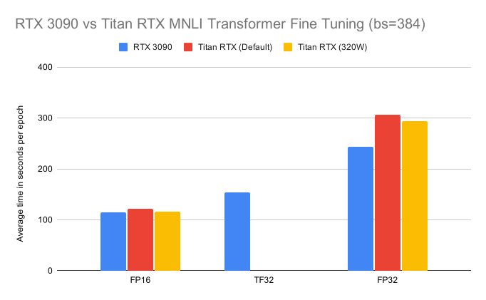
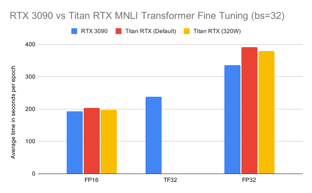

# Titan RTX vs RTX 3090 Transformer Benchmarks

Used pytorch source compiled at commit `c3466da` to get Ampere support.

Software versions (see `environment.yml` for all software versions):

```
In [1]: import torch
   ...: print("Pytorch version：")
   ...: print(torch.__version__)
   ...: print("CUDA Version: ")
   ...: print(torch.version.cuda)
   ...: print("cuDNN version is :")
   ...: print(torch.backends.cudnn.version())
   ...: print("Arch version is :")
   ...: print(torch._C._cuda_getArchFlags())
Pytorch version：
1.8.0a0+c3466da
CUDA Version:
11.1
cuDNN version is :
8004
Arch version is :
sm_86 sm_75
```

Run `download_glue_data.py` to download data into `./glue_data`

Platform details:

* AMD Ryzen Threadripper 1900X 8-Core Processor
* 128GB G.Skill 2400Mhz RAM (F4-2400C16-16GFT)
* Ubuntu 20.04.01
* NVME SSD Samsung 960 EVO 250GB

NB: GPU Fans were set to 99% using [coolgpus](https://github.com/andyljones/coolgpus)

# Batch Size = 384 (Approx 18-22GB of VRAM)

Led to GPU utilisation from 90-100%.



## fp16 

Run with `fp16=True`, `per_gpu_train_batch_size=384`.

### Gigabyte GeForce RTX 3090 TURBO 24G

Run with default power settings.

```
❯ CUDA_VISIBLE_DEVICES=0 python 01_text_classification.py
Iteration: 100%|█████████████████████████████████████████████████████| 261/261 [01:55<00:00,  2.27it/s]
Iteration: 100%|█████████████████████████████████████████████████████| 261/261 [01:53<00:00,  2.29it/s]
Iteration: 100%|█████████████████████████████████████████████████████| 261/261 [01:54<00:00,  2.29it/s]
Epoch: 100%|████████████████████████████████████████████████████████████| 3/3 [05:43<00:00, 114.38s/it]
```

### Nvidia Titan RTX

Run with default power settings.

```
❯ CUDA_VISIBLE_DEVICES=1 python 01_text_classification.py
Iteration: 100%|█████████████████████████████████████████████████████| 261/261 [02:01<00:00,  2.14it/s]
Iteration: 100%|█████████████████████████████████████████████████████| 261/261 [02:01<00:00,  2.15it/s]
Iteration: 100%|█████████████████████████████████████████████████████| 261/261 [02:01<00:00,  2.14it/s]
Epoch: 100%|████████████████████████████████████████████████████████████| 3/3 [06:05<00:00, 121.68s/it]
```

Run with:

```
sudo nvidia-smi -i 1 --cuda-clocks=OVERRIDE
sudo nvidia-smi -i 1 -pl 320
```

```
❯ CUDA_VISIBLE_DEVICES=1 python 01_text_classification.py
Iteration: 100%|█████████████████████████████████████████████████████| 261/261 [01:55<00:00,  2.25it/s]
Iteration: 100%|█████████████████████████████████████████████████████| 261/261 [01:55<00:00,  2.25it/s]
Iteration: 100%|█████████████████████████████████████████████████████| 261/261 [01:56<00:00,  2.25it/s]
Epoch: 100%|████████████████████████████████████████████████████████████| 3/3 [05:47<00:00, 115.96s/it]
```

## fp32

Run with `fp16=False`, `per_gpu_train_batch_size=384`.

### Gigabyte GeForce RTX 3090 TURBO 24G

Run with default power settings.

```
❯ CUDA_VISIBLE_DEVICES=0 python 01_text_classification.py
Iteration: 100%|█████████████████████████████████████████████████████| 261/261 [02:35<00:00,  1.68it/s]
Iteration: 100%|█████████████████████████████████████████████████████| 261/261 [02:33<00:00,  1.70it/s]
Iteration: 100%|█████████████████████████████████████████████████████| 261/261 [02:34<00:00,  1.69it/s]
Epoch: 100%|████████████████████████████████████████████████████████████| 3/3 [07:43<00:00, 154.39s/it]
```

### Nvidia Titan RTX

Run with default power settings.

```
 CUDA_VISIBLE_DEVICES=1 python 01_text_classification.py
Iteration: 100%|█████████████████████████████████████████████████████| 261/261 [05:05<00:00,  1.17s/it]
Iteration: 100%|█████████████████████████████████████████████████████| 261/261 [05:06<00:00,  1.17s/it]
Iteration: 100%|█████████████████████████████████████████████████████| 261/261 [05:06<00:00,  1.17s/it]
Epoch: 100%|████████████████████████████████████████████████████████████| 3/3 [15:17<00:00, 305.84s/it]
```

Run with:

```
sudo nvidia-smi -i 1 --cuda-clocks=OVERRIDE
sudo nvidia-smi -i 1 -pl 320
```

```
CUDA_VISIBLE_DEVICES=1 python 01_text_classification.py
Iteration: 100%|█████████████████████████████████████████████████████| 261/261 [04:52<00:00,  1.12s/it]
Iteration: 100%|█████████████████████████████████████████████████████| 261/261 [04:54<00:00,  1.13s/it]
Iteration: 100%|█████████████████████████████████████████████████████| 261/261 [04:55<00:00,  1.13s/it]
Epoch: 100%|████████████████████████████████████████████████████████████| 3/3 [14:42<00:00, 294.21s/it]
```

# Batch Size = 32 (Approx 3.7GB of VRAM)

Led to GPU utilisation of around 80-85%.



## fp16 

Training code adapted from [huggingface fine tuning examples](https://colab.research.google.com/github/huggingface/blog/blob/master/notebooks/trainer/01_text_classification.ipynb)

Run with `fp16=True`, `per_gpu_train_batch_size=32`. Logging and checkpointing was disabled.

### Gigabyte GeForce RTX 3090 TURBO 24G

Run with default power settings.

```
❯ CUDA_VISIBLE_DEVICES=0 python 01_text_classification.py
Iteration: 100%|███████████████████████████████████████████████████| 3125/3125 [03:13<00:00, 16.14it/s]
Iteration: 100%|███████████████████████████████████████████████████| 3125/3125 [03:13<00:00, 16.13it/s]
Iteration: 100%|███████████████████████████████████████████████████| 3125/3125 [03:12<00:00, 16.21it/s]
Epoch: 100%|████████████████████████████████████████████████████████████| 3/3 [09:40<00:00, 193.35s/it]
```

### Nvidia Titan RTX

Run with default power settings.

```
❯ CUDA_VISIBLE_DEVICES=1 python 01_text_classification.py
Iteration: 100%|███████████████████████████████████████████████████| 3125/3125 [03:25<00:00, 15.23it/s]
Iteration: 100%|███████████████████████████████████████████████████| 3125/3125 [03:23<00:00, 15.35it/s]
Iteration: 100%|███████████████████████████████████████████████████| 3125/3125 [03:23<00:00, 15.37it/s]
Epoch: 100%|████████████████████████████████████████████████████████████| 3/3 [10:12<00:00, 204.01s/it]
```

Run with:

```
sudo nvidia-smi -i 1 --cuda-clocks=OVERRIDE
sudo nvidia-smi -i 1 -pl 320
```

```
❯ CUDA_VISIBLE_DEVICES=1 python 01_text_classification.py
Iteration: 100%|███████████████████████████████████████████████████| 3125/3125 [03:17<00:00, 15.80it/s]
Iteration: 100%|███████████████████████████████████████████████████| 3125/3125 [03:17<00:00, 15.85it/s]
Iteration: 100%|███████████████████████████████████████████████████| 3125/3125 [03:18<00:00, 15.76it/s]
Epoch: 100%|████████████████████████████████████████████████████████████| 3/3 [09:53<00:00, 197.78s/it]
```

## fp32

Run with `fp16=False`, `per_gpu_train_batch_size=32`. Logging and checkpointing was disabled.

### Gigabyte GeForce RTX 3090 TURBO 24G

```
❯ CUDA_VISIBLE_DEVICES=0 python 01_text_classification.py
Iteration: 100%|███████████████████████████████████████████████████| 3125/3125 [03:59<00:00, 13.06it/s]
Iteration: 100%|███████████████████████████████████████████████████| 3125/3125 [03:56<00:00, 13.19it/s]
Iteration: 100%|███████████████████████████████████████████████████| 3125/3125 [03:58<00:00, 13.10it/s]
Epoch: 100%|████████████████████████████████████████████████████████████| 3/3 [11:54<00:00, 238.24s/it]
```

Run with default power settings.

### Nvidia Titan RTX

Run with default power settings.

```
❯ CUDA_VISIBLE_DEVICES=1 python 01_text_classification.py
Iteration: 100%|███████████████████████████████████████████████████| 3125/3125 [06:28<00:00,  8.04it/s]
Iteration: 100%|███████████████████████████████████████████████████| 3125/3125 [06:32<00:00,  7.97it/s]
Iteration: 100%|███████████████████████████████████████████████████| 3125/3125 [06:31<00:00,  7.98it/s]
Epoch: 100%|████████████████████████████████████████████████████████████| 3/3 [19:32<00:00, 390.78s/it]
```

Run with:

```
sudo nvidia-smi -i 1 --cuda-clocks=OVERRIDE
sudo nvidia-smi -i 1 -pl 320
```

```
❯ CUDA_VISIBLE_DEVICES=1 python 01_text_classification.py
Iteration: 100%|███████████████████████████████████████████████████| 3125/3125 [06:18<00:00,  8.25it/s]
Iteration: 100%|███████████████████████████████████████████████████| 3125/3125 [06:18<00:00,  8.26it/s]
Iteration: 100%|███████████████████████████████████████████████████| 3125/3125 [06:20<00:00,  8.21it/s]
Epoch: 100%|████████████████████████████████████████████████████████████| 3/3 [18:57<00:00, 379.21s/it]
```

## Model

```
DistilBertForSequenceClassification(
  (distilbert): DistilBertModel(
    (embeddings): Embeddings(
      (word_embeddings): Embedding(28996, 768, padding_idx=0)
      (position_embeddings): Embedding(512, 768)
      (LayerNorm): LayerNorm((768,), eps=1e-12, elementwise_affine=True)
      (dropout): Dropout(p=0.1, inplace=False)
    )
    (transformer): Transformer(
      (layer): ModuleList(
        (0): TransformerBlock(
          (attention): MultiHeadSelfAttention(
            (dropout): Dropout(p=0.1, inplace=False)
            (q_lin): Linear(in_features=768, out_features=768, bias=True)
            (k_lin): Linear(in_features=768, out_features=768, bias=True)
            (v_lin): Linear(in_features=768, out_features=768, bias=True)
            (out_lin): Linear(in_features=768, out_features=768, bias=True)
          )
          (sa_layer_norm): LayerNorm((768,), eps=1e-12, elementwise_affine=True)
          (ffn): FFN(
            (dropout): Dropout(p=0.1, inplace=False)
            (lin1): Linear(in_features=768, out_features=3072, bias=True)
            (lin2): Linear(in_features=3072, out_features=768, bias=True)
          )
          (output_layer_norm): LayerNorm((768,), eps=1e-12, elementwise_affine=True)
        )
        (1): TransformerBlock(
          (attention): MultiHeadSelfAttention(
            (dropout): Dropout(p=0.1, inplace=False)
            (q_lin): Linear(in_features=768, out_features=768, bias=True)
            (k_lin): Linear(in_features=768, out_features=768, bias=True)
            (v_lin): Linear(in_features=768, out_features=768, bias=True)
            (out_lin): Linear(in_features=768, out_features=768, bias=True)
          )
          (sa_layer_norm): LayerNorm((768,), eps=1e-12, elementwise_affine=True)
          (ffn): FFN(
            (dropout): Dropout(p=0.1, inplace=False)
            (lin1): Linear(in_features=768, out_features=3072, bias=True)
            (lin2): Linear(in_features=3072, out_features=768, bias=True)
          )
          (output_layer_norm): LayerNorm((768,), eps=1e-12, elementwise_affine=True)
        )
        (2): TransformerBlock(
          (attention): MultiHeadSelfAttention(
            (dropout): Dropout(p=0.1, inplace=False)
            (q_lin): Linear(in_features=768, out_features=768, bias=True)
            (k_lin): Linear(in_features=768, out_features=768, bias=True)
            (v_lin): Linear(in_features=768, out_features=768, bias=True)
            (out_lin): Linear(in_features=768, out_features=768, bias=True)
          )
          (sa_layer_norm): LayerNorm((768,), eps=1e-12, elementwise_affine=True)
          (ffn): FFN(
            (dropout): Dropout(p=0.1, inplace=False)
            (lin1): Linear(in_features=768, out_features=3072, bias=True)
            (lin2): Linear(in_features=3072, out_features=768, bias=True)
          )
          (output_layer_norm): LayerNorm((768,), eps=1e-12, elementwise_affine=True)
        )
        (3): TransformerBlock(
          (attention): MultiHeadSelfAttention(
            (dropout): Dropout(p=0.1, inplace=False)
            (q_lin): Linear(in_features=768, out_features=768, bias=True)
            (k_lin): Linear(in_features=768, out_features=768, bias=True)
            (v_lin): Linear(in_features=768, out_features=768, bias=True)
            (out_lin): Linear(in_features=768, out_features=768, bias=True)
          )
          (sa_layer_norm): LayerNorm((768,), eps=1e-12, elementwise_affine=True)
          (ffn): FFN(
            (dropout): Dropout(p=0.1, inplace=False)
            (lin1): Linear(in_features=768, out_features=3072, bias=True)
            (lin2): Linear(in_features=3072, out_features=768, bias=True)
          )
          (output_layer_norm): LayerNorm((768,), eps=1e-12, elementwise_affine=True)
        )
        (4): TransformerBlock(
          (attention): MultiHeadSelfAttention(
            (dropout): Dropout(p=0.1, inplace=False)
            (q_lin): Linear(in_features=768, out_features=768, bias=True)
            (k_lin): Linear(in_features=768, out_features=768, bias=True)
            (v_lin): Linear(in_features=768, out_features=768, bias=True)
            (out_lin): Linear(in_features=768, out_features=768, bias=True)
          )
          (sa_layer_norm): LayerNorm((768,), eps=1e-12, elementwise_affine=True)
          (ffn): FFN(
            (dropout): Dropout(p=0.1, inplace=False)
            (lin1): Linear(in_features=768, out_features=3072, bias=True)
            (lin2): Linear(in_features=3072, out_features=768, bias=True)
          )
          (output_layer_norm): LayerNorm((768,), eps=1e-12, elementwise_affine=True)
        )
        (5): TransformerBlock(
          (attention): MultiHeadSelfAttention(
            (dropout): Dropout(p=0.1, inplace=False)
            (q_lin): Linear(in_features=768, out_features=768, bias=True)
            (k_lin): Linear(in_features=768, out_features=768, bias=True)
            (v_lin): Linear(in_features=768, out_features=768, bias=True)
            (out_lin): Linear(in_features=768, out_features=768, bias=True)
          )
          (sa_layer_norm): LayerNorm((768,), eps=1e-12, elementwise_affine=True)
          (ffn): FFN(
            (dropout): Dropout(p=0.1, inplace=False)
            (lin1): Linear(in_features=768, out_features=3072, bias=True)
            (lin2): Linear(in_features=3072, out_features=768, bias=True)
          )
          (output_layer_norm): LayerNorm((768,), eps=1e-12, elementwise_affine=True)
        )
      )
    )
  )
  (pre_classifier): Linear(in_features=768, out_features=768, bias=True)
  (classifier): Linear(in_features=768, out_features=3, bias=True)
  (dropout): Dropout(p=0.2, inplace=False)
)
```
